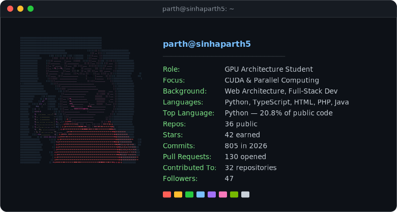

 

---

## whoami

I'm currently studying **GPU architecture** and diving deep into **CUDA / parallel computing** — how work actually schedules across warps, memory hierarchies, and where the bottlenecks really live. Before that, I spent my time in **web architecture and full-stack development**, so I tend to think about performance problems from both the systems side and the application side.

- 🔭 Learning: GPU microarchitecture, CUDA kernels, memory coalescing, occupancy tuning
- 🌐 Background: full-stack web development — APIs, infra, and everything in between
- 🌱 Currently bridging the gap between "ships fast" web engineering and "counts cycles" systems programming
- 📫 Reach me via the badges above

 

auto-refreshed daily at 00:00 UTC via <a href="./.github/workflows/update-fastfetch.yml">GitHub Actions</a>

 

## Tech Stack

**Systems & GPU**

**Languages & Web**

**Tools & Infra**

---

## Performance Metrics

> Stats are pulled live from the GitHub API and only reflect **public** activity.

---

&nbsp;•&nbsp;

&nbsp;•&nbsp;

